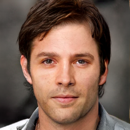
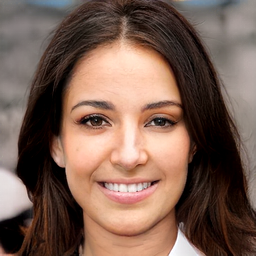

# Source Codes for *Against linkage: A novel generative face anonymization framework with style diversification*

[StyleDiverse-GFA](https://ietresearch.onlinelibrary.wiley.com/doi/full/10.1049/ipr2.13237) is an advanced framework designed to generate virtual faces with diverse identities and exceptional visual quality, effectively mitigating potential linkage attacks. By diversifying the feature distribution in the latent space and leveraging the power of self-supervised face generation, SD-GFA produces highly realistic virtual faces. 


## Usage

### Installation
Follow these simple steps to install and set up this project:
1. **Clone the Repository**  
  Clone this repository to your local machine using the following command:
  ```bash
  git clone https://github.com/JasonZuu/SD-GFA-2024.git
  ```
2. **Set Up the Python Environment**
  To prevent conflicts with your system’s Python installation, it is highly recommended to use a virtual environment. You can create one easily with [Anaconda](https://www.anaconda.com/). 
  This project was developed and tested with Python 3.8, which is recommended for reproducing the results. Set up your environment with the following steps:
  ```bash
  conda create -n sdgfa python=3.8
  conda activate sdgfa
  pip install -r requirements.txt
  ```

### Data Preparation
This project is built upon the [CelebA-HQ](https://paperswithcode.com/dataset/celeba-hq) dataset. If you use this dataset in your work, please remember to cite the original authors of CelebA-HQ as a token of acknowledgment for their brilliant contribution.

For convenience, we have shared our processed dataset on Kaggle. You can download the dataset, extract the compressed files, and place all the contents into a directory named `data` within the project.

Data download link: [https://www.kaggle.com/datasets/mingchengzhu/stylediversegfa-dataset-and-model-weights/](url)

The expected project structure after organizing the data should look like this:

->SD-GFA-2024(dir)
--> data(dir)
---> celeba-256(dir)
---> celebahq_256_train.csv
---> celebahq_256_val.csv
---> celebahq_256_test.csv

### Training
You can train the SD-GFA model by running the `train.py` file directly or by using the following command, which utilizes the default configurations and hyperparameters:
```bash
  python train.py --entity <your_wandb_username>
```

You can adjust additional training configurations by editing the `configs/algo_config.py` file to suit your needs.

Training the model typically takes about 2 days and requires a GPU with 24GB of VRAM. If training the model is too time-consuming, you can download our pre-trained model weights and use them for face generation.  

Model weights download link: [https://www.kaggle.com/datasets/mingchengzhu/stylediversegfa-dataset-and-model-weights/](url)

Please note that due to code restructuring and differences in random seeds, the generated results may vary slightly from those presented in the paper.

### Face Generation
After training your own model or using our pre-trained model weights, you can generate faces with the following command:
```bash
  python generate.py --weights_path <your_model_weights_path> --num_gen_img 100
```

Here are some examples generated using the above command:
<p align="center">
  
  
</p>


## Acknowledges
Codes from these brilliant repositories are used: 
+ [StyleSwin](https://github.com/microsoft/StyleSwin) for decoder.
+ [FaceNet](https://github.com/timesler/facenet-pytorch) for face detection and face recognization.

## Cite Us
```BibTex
@article{zhu2024against,
  title={Against linkage: A novel generative face anonymization framework with style diversification},
  author={Zhu, Mingcheng and He, Peisong and Zhang, Yuhao and Li, Jinghan and Qiu, Yupeng},
  journal={IET Image Processing},
  year={2024},
  publisher={Wiley Online Library}
}
```