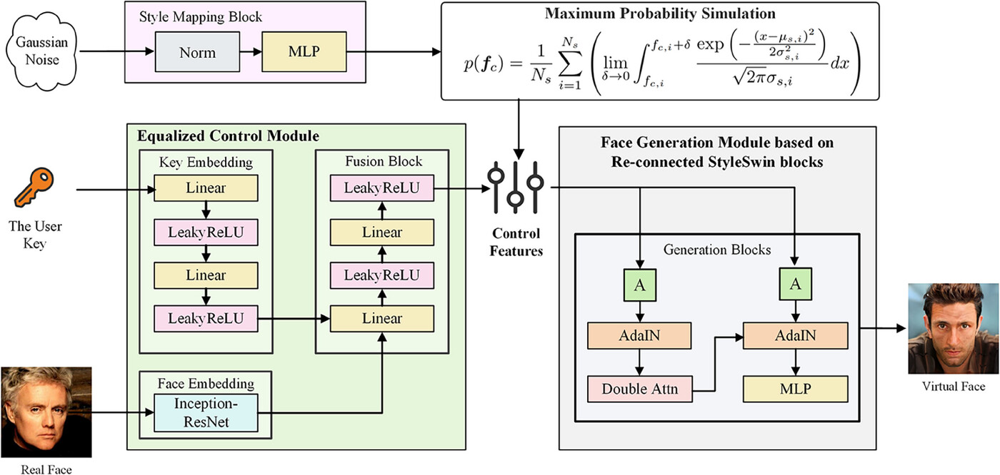

# Source Codes for *Against linkage: A novel generative face anonymization framework with style diversification*

[SD-GFA](https://ietresearch.onlinelibrary.wiley.com/doi/full/10.1049/ipr2.13237) is an advanced framework designed to generate virtual faces with diverse identities and exceptional visual quality, effectively mitigating potential linkage attacks. By diversifying the feature distribution in the latent space and leveraging the power of self-supervised face generation, SD-GFA produces highly realistic virtual faces. 


## Usage
### Installation
1. Clone this repository into your local computer with the following command
```bash
git clone https://github.com/JasonZuu/SD-GFA-2024.git
```

### Data Preparation

### Training

### Face Generation


## Acknowledges
Codes from these brilliant repositories are used: 
+ [StyleSwin](https://github.com/microsoft/StyleSwin) for decoder.
+ [FaceNet](https://github.com/timesler/facenet-pytorch) for face detection and face recognization.

## Cite Us
```BibTex
@article{zhu2024against,
  title={Against linkage: A novel generative face anonymization framework with style diversification},
  author={Zhu, Mingcheng and He, Peisong and Zhang, Yuhao and Li, Jinghan and Qiu, Yupeng},
  journal={IET Image Processing},
  year={2024},
  publisher={Wiley Online Library}
}
```